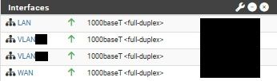

# Proxmox VE Infrastructure

This repository documents a **sanitized case study of a production infrastructure environment** that I implemented and administered using Proxmox VE.

The environment includes virtualization, Linux workloads, virtual networking, VLAN segmentation, pfSense integration, storage management, access control, and infrastructure troubleshooting.

All environment-specific identifiers and sensitive configuration details have been removed or anonymized for public documentation.

## Scope

The infrastructure work documented in this repository includes:

- Proxmox VE administration
- Virtual machine provisioning and lifecycle management
- CPU, memory, and storage resource allocation
- Virtual networking
- Linux bridges and VLAN integration
- pfSense integration
- Network segmentation
- Storage management
- Administrative access controls
- Infrastructure troubleshooting

## Technologies

- Proxmox VE
- Linux
- Ubuntu Server
- Virtualization
- Virtual Machines
- TCP/IP Networking
- VLANs
- pfSense
- SSH
- Storage Management

## Documentation

- [`Architecture`](docs/architecture.md) — Infrastructure architecture and component organization
- [`VM Provisioning`](docs/vm-provisioning.md) — Virtual machine creation and provisioning
- [`Networking`](docs/networking.md) — Proxmox networking, VLANs, pfSense integration, and segmentation
- [`Storage`](docs/storage.md) — Virtual storage and capacity management
- [`Security Hardening`](docs/security-hardening.md) — Administrative access and security controls

## Infrastructure Evidence

The following screenshots are sanitized views of the infrastructure documented in this repository. Environment-specific information has been removed to preserve confidentiality.

### Proxmox VE Datacenter Overview

Datacenter-level view of the Proxmox VE environment, showing node health, virtual workloads, resource utilization, and storage consumption.

### Proxmox VE Resources

Resource tree showing the organization of virtual workloads and storage resources managed through Proxmox VE.

### Virtual Machine Hardware

Example virtual machine hardware configuration showing CPU, memory, virtual storage, controller, installation media, and virtual network interface allocation.

### Proxmox VE Network Configuration

Host-level network configuration showing the integration of physical interfaces, Linux VLAN interfaces, and Linux bridges used by the virtualized infrastructure.

### pfSense Network Interfaces

Sanitized pfSense interface view showing WAN, LAN, and VLAN-based network segmentation integrated with the Proxmox VE environment.
