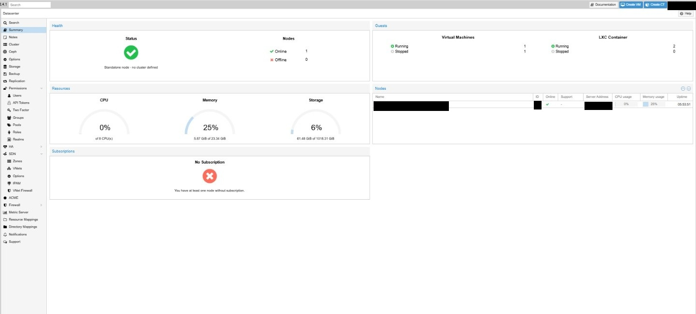
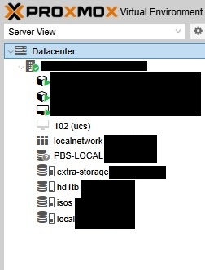
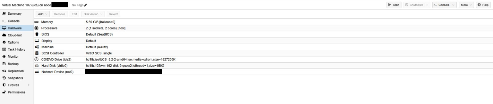
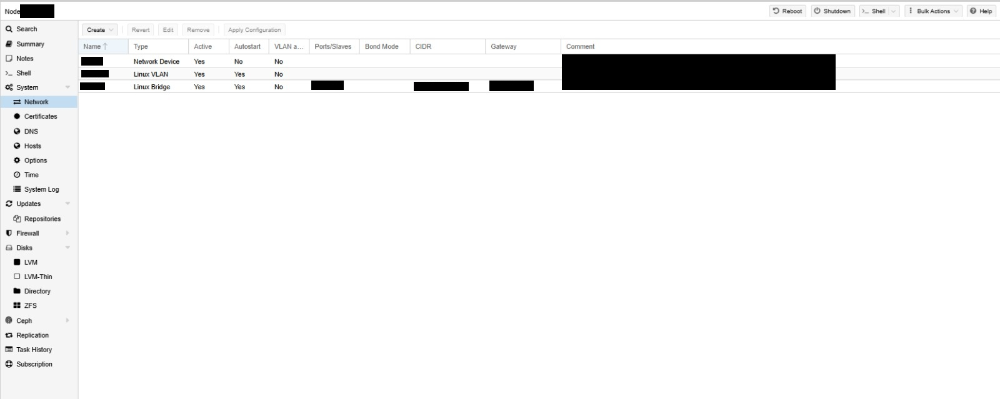

# Proxmox VE Infrastructure Case Study

Sanitized case study based on a **production Proxmox VE environment** that I implemented and currently administer as part of a business IT infrastructure.

The environment hosts virtual machines and LXC containers supporting infrastructure and business workloads, with dedicated compute resources, virtual networking, storage management, administrative access controls, and integration with the external network infrastructure.

This repository focuses specifically on the **Proxmox VE virtualization layer**. Company-specific identifiers, network addressing, hostnames, credentials, and sensitive configuration details have been removed or anonymized.

## Areas Covered

- Proxmox VE administration
- Virtual machine provisioning and lifecycle management
- LXC container administration
- CPU and memory resource allocation
- Virtual disk and storage management
- Linux bridges and virtual networking
- VLAN integration
- Linux server workloads
- Infrastructure service hosting
- Administrative access control
- Two-factor authentication
- Resource monitoring
- Infrastructure troubleshooting

## Architecture

Proxmox VE provides the virtualization layer for multiple infrastructure workloads.

At a high level:

```text
External Network Infrastructure
            │
            ▼
      Proxmox VE Host
            │
     ┌──────┴──────┐
     │             │
 Virtual Machines  LXC Containers
     │             │
     └──────┬──────┘
            │
   Infrastructure & Business Workloads
```

Routing, firewalling, and broader network security functions are handled outside the Proxmox VE platform and integrate with its virtual networking layer.

## Administration

My responsibilities in this environment include:

- Provisioning and maintaining virtual machines and LXC containers
- Allocating and adjusting compute, memory, and storage resources
- Managing Proxmox VE virtual networking
- Integrating virtual workloads with segmented networks
- Monitoring host and workload resource utilization
- Managing administrative access to the hypervisor
- Troubleshooting virtualization, networking, storage, and guest-level issues
- Maintaining the Proxmox VE platform in a production environment

## Documentation

Technical documentation for this case study:

- [Infrastructure Architecture](docs/architecture.md)
- [Virtual Machine Provisioning](docs/vm-provisioning.md)
- [Networking](docs/networking.md)
- [Storage](docs/storage.md)
- [Security Hardening](docs/security-hardening.md)

## Infrastructure Evidence

The following screenshots are sanitized views from the production Proxmox VE environment.

Company-specific identifiers, network addressing, hostnames, and sensitive configuration details have been removed or anonymized.

### Proxmox VE Datacenter Overview



Datacenter-level view showing the active Proxmox VE node, virtualized workloads, resource utilization, and storage usage.

### Proxmox VE Resources



Resource view showing virtual machines, LXC containers, and storage resources administered through Proxmox VE.

### Virtual Machine Hardware Configuration



Example of a production virtual machine hardware configuration, including allocated CPU, memory, virtual storage, controller configuration, and virtual network interface.

### Proxmox VE Network Configuration



Host-level virtual networking configuration showing physical interfaces, Linux VLAN interfaces, and Linux bridges used by the Proxmox VE virtualization environment.
